# 🐾 AI Pet Scanner

**AI-powered pet health screening and wellness companion**

AI Pet Scanner is an AI-powered mobile computer-vision platform that analyzes pet images through a multi-stage pipeline combining image-quality validation, pet and region detection, multimodal visual inference, confidence calibration, and structured observation generation. The platform maintains pet-specific scan histories and longitudinal comparisons, enabling owners to track visual changes over time while using a modular AI-provider architecture, privacy-aware media processing, and deterministic safety/policy controls to separate AI-assisted observations from veterinary diagnosis.


[](LICENSE)
[](https://github.com/lucylow/ai-pet-scanner)
[](https://github.com/lucylow/ai-pet-scanner)
[](https://github.com/lucylow/ai-pet-scanner)

---

# Table of Contents

* [1. Project Overview](#1-project-overview)
* [2. Why AI Pet Scanner Exists](#2-why-ai-pet-scanner-exists)
* [3. Core Product Vision](#3-core-product-vision)
* [4. Scope and Safety Boundaries](#4-scope-and-safety-boundaries)
* [5. Repository Snapshot](#5-repository-snapshot)
* [6. Product Capabilities](#6-product-capabilities)
* [7. User Experience](#7-user-experience)
* [8. High-Level Architecture](#8-high-level-architecture)
* [9. Application Layers](#9-application-layers)
* [10. AI Scanning Pipeline](#10-ai-scanning-pipeline)
* [11. Image Capture and Quality Control](#11-image-capture-and-quality-control)
* [12. Pet Detection and Region of Interest](#12-pet-detection-and-region-of-interest)
* [13. Health-Signal Classification](#13-health-signal-classification)
* [14. Confidence, Uncertainty, and Explainability](#14-confidence-uncertainty-and-explainability)
* [15. Results and Care Guidance](#15-results-and-care-guidance)
* [16. Pet Profiles](#16-pet-profiles)
* [17. Scan History and Longitudinal Tracking](#17-scan-history-and-longitudinal-tracking)
* [18. Data Model](#18-data-model)
* [19. API Architecture](#19-api-architecture)
* [20. AI Provider Abstraction](#20-ai-provider-abstraction)
* [21. Offline and Fallback Strategy](#21-offline-and-fallback-strategy)
* [22. Privacy and Data Protection](#22-privacy-and-data-protection)
* [23. Security Architecture](#23-security-architecture)
* [24. Performance Engineering](#24-performance-engineering)
* [25. Accessibility and Inclusive UX](#25-accessibility-and-inclusive-ux)
* [26. Observability and Diagnostics](#26-observability-and-diagnostics)
* [27. Testing Strategy](#27-testing-strategy)
* [28. CI/CD](#28-cicd)
* [29. Environment Configuration](#29-environment-configuration)
* [30. Deployment Architecture](#30-deployment-architecture)
* [31. Recommended Project Structure](#31-recommended-project-structure)
* [32. Development Workflow](#32-development-workflow)
* [33. Example API Contracts](#33-example-api-contracts)
* [34. Example AI Result Schema](#34-example-ai-result-schema)
* [35. State Machine](#35-state-machine)
* [36. End-to-End Sequence](#36-end-to-end-sequence)
* [37. Failure Modes](#37-failure-modes)
* [38. Product Analytics](#38-product-analytics)
* [39. Monetization Architecture](#39-monetization-architecture)
* [40. Roadmap](#40-roadmap)
* [41. Future AI Capabilities](#41-future-ai-capabilities)
* [42. Potential Integrations](#42-potential-integrations)
* [43. Demo and Hackathon Presentation Flow](#43-demo-and-hackathon-presentation-flow)
* [44. Contribution Guide](#44-contribution-guide)
* [45. Coding Standards](#45-coding-standards)
* [46. Pull Request Checklist](#46-pull-request-checklist)
* [47. Troubleshooting](#47-troubleshooting)
* [48. FAQ](#48-faq)
* [49. Glossary](#49-glossary)
* [50. License](#50-license)
* [51. Acknowledgements](#51-acknowledgements)

---

# 1. Project Overview

AI Pet Scanner is a mobile-first AI pet wellness application concept designed to help pet owners perform structured, repeatable visual checks of their pets.

The central product workflow is:

```text
Create Pet
    ↓
Select Scan Type
    ↓
Capture Image / Video
    ↓
Validate Image Quality
    ↓
Detect Pet + Relevant Region
    ↓
Run AI Analysis
    ↓
Apply Confidence + Safety Rules
    ↓
Generate Structured Observation
    ↓
Display Result
    ↓
Save to History
    ↓
Compare Future Scans
```

The objective is not to replace veterinary care.

Instead, AI Pet Scanner is designed to help transform:

> "Something looks different."

into:

> "Here is what I observed, when I observed it, what changed, and what information I can bring to a veterinary professional."

This creates a repeatable digital workflow around pet observation.

---

## Product Philosophy

A useful pet wellness application should optimize for:

* evidence,
* repeatability,
* clarity,
* transparency,
* uncertainty,
* privacy,
* professional escalation.

It should **not** optimize for making the AI appear more certain than the evidence supports.

---

# 2. Why AI Pet Scanner Exists

Pet owners often notice changes before they know exactly how to describe those changes.

Examples could include:

* changes in fur texture,
* localized redness-like visual changes,
* visible swelling-like appearance,
* changes around eyes,
* changes around ears,
* dental buildup,
* visible skin differences,
* changes in paw appearance,
* visible marks,
* asymmetry,
* differences between two photographs.

The technical challenge is therefore not simply:

> "Can AI identify a disease?"

The more useful product question is:

> "Can AI help a pet owner capture, organize, and track visual evidence consistently?"

AI Pet Scanner is designed around that second problem.

---

# 3. Core Product Vision

## Product statement

> **Turn a pet photo into a structured wellness observation that can be tracked over time.**

The application combines:

```text
Computer Vision
+
Multimodal AI
+
Guided Capture
+
Pet Profiles
+
Longitudinal History
+
Safety / Confidence Logic
=
AI Pet Scanner
```

## Core principles

### Evidence first

Every result should have a relationship to:

* the captured media,
* the pet,
* the body region,
* the timestamp,
* the analysis,
* the confidence level.

### Uncertainty is a feature

When the image is unclear, the system should say so.

### Repeatability beats novelty

A scan should be reproducible.

### Explainability matters

Users should understand why an observation appeared.

### Professional escalation is explicit

The AI supports observation and organization.

It does not replace veterinary examination.

---

# 4. Scope and Safety Boundaries

AI Pet Scanner should be positioned as a:

> **Pet wellness screening and observation assistant**

rather than a:

> **Veterinary diagnostic system**

## Appropriate language

Use terms such as:

* visual observation,
* possible signal,
* screening result,
* needs closer attention,
* image-quality limitation,
* consider professional evaluation,
* compare with previous scan.

Avoid unsupported statements such as:

* definitive diagnosis,
* guaranteed healthy,
* 100% safe,
* confirmed disease,
* veterinary diagnosis.

---

## Safety architecture

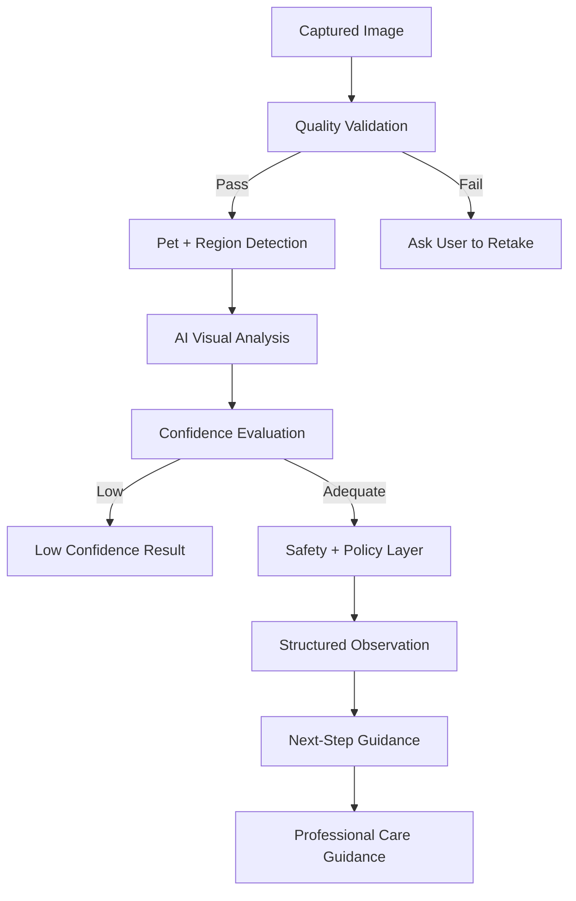

---

# 5. Repository Snapshot

## Repository

```text
https://github.com/lucylow/ai-pet-scanner
```

The public repository currently exposes the following top-level artifacts:

```text
ai-pet-scanner/
├── LICENSE
├── README.md
└── pet-health-scanner.zip
```

The bundled ZIP is the primary application artifact.

Because the public repository landing page does not expose the entire application source tree directly, implementation-specific details such as exact framework versions, AI provider SDK versions, and backend infrastructure should be verified against the contents of `pet-health-scanner.zip` before being presented as hard implementation facts.

This README therefore separates:

1. repository facts,
2. recommended architecture,
3. example contracts,
4. future implementation opportunities.

---

# 6. Product Capabilities

AI Pet Scanner can be organized into six major capability groups.

## Capture

* camera access,
* gallery import,
* image capture,
* optional video,
* framing guides,
* lighting guidance,
* focus guidance,
* retake workflow.

## Analyze

* image quality scoring,
* pet detection,
* region detection,
* visual feature extraction,
* classification,
* anomaly-like visual signal detection,
* confidence scoring.

## Understand

* natural-language observations,
* confidence indicators,
* explanations,
* limitations,
* recommended next steps.

## Track

* pet profiles,
* scan history,
* before/after comparisons,
* notes,
* reminders,
* baselines.

## Share

* scan summaries,
* image/result export,
* veterinarian-friendly reports.

## Monetize

* premium history,
* advanced comparisons,
* expanded AI usage,
* multi-pet accounts,
* subscription entitlements.

---

# 7. User Experience

## 7.1 Main Navigation

```text
                   HOME
                    |
       +------------+------------+
       |            |            |
       v            v            v
      SCAN         PETS        HISTORY
       |            |            |
       v            v            v
  SELECT AREA   PET PROFILE   PAST RESULTS
       |
       v
    CAPTURE
       |
       v
 QUALITY CHECK
       |
       v
    ANALYZE
       |
       v
     RESULT
       |
   +---+---+
   |   |   |
   v   v   v
 SAVE SHARE COMPARE
```

---

## 7.2 Home Screen

The home screen should make the most important action obvious:

```text
┌──────────────────────────────────────┐
│ AI PET SCANNER                      │
│                                      │
│ Good morning 👋                     │
│                                      │
│ Milo                                 │
│ Last scanned 7 days ago              │
│                                      │
│        ┌──────────────────┐          │
│        │   START SCAN     │          │
│        └──────────────────┘          │
│                                      │
│ Recent scans                         │
│ ─────────────────────────────────── │
│ Eye          7 days ago              │
│ Coat         14 days ago             │
│ Paw          28 days ago             │
└──────────────────────────────────────┘
```

---

# 8. High-Level Architecture

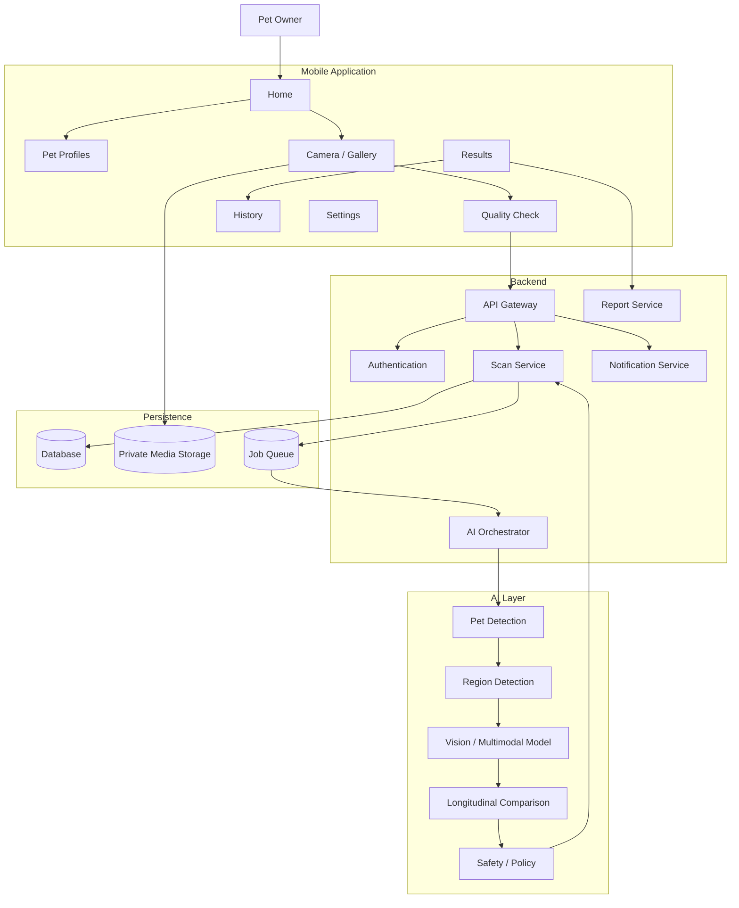

---

# 9. Application Layers

A maintainable implementation should separate responsibilities.

```text
┌─────────────────────────────────────────────┐
│ Presentation Layer                          │
│ Screens • Navigation • Components • UX      │
├─────────────────────────────────────────────┤
│ Application Layer                            │
│ Scan Use Cases • Pet Use Cases • Reports    │
├─────────────────────────────────────────────┤
│ Domain Layer                                 │
│ Scan • Pet • Observation • Safety            │
├─────────────────────────────────────────────┤
│ Infrastructure Layer                        │
│ Camera • API • Storage • AI • Analytics      │
└─────────────────────────────────────────────┘
```

## Presentation Layer

Responsible for:

* rendering,
* interactions,
* navigation,
* camera UI,
* loading states,
* error states,
* accessibility.

The presentation layer should not contain direct AI-provider calls.

---

## Application Layer

Responsible for workflows such as:

```ts
startScan()
captureEvidence()
validateEvidence()
runAnalysis()
saveResult()
compareScans()
shareResult()
```

---

## Domain Layer

Responsible for product concepts:

* Pet,
* Scan,
* Observation,
* Confidence,
* Recommendation,
* Escalation.

---

## Infrastructure Layer

Responsible for:

* camera,
* media,
* HTTP,
* storage,
* authentication,
* AI SDKs,
* notifications,
* analytics.

---

# 10. AI Scanning Pipeline

A robust AI scanner should use multiple stages rather than one model request.

```mermaid
flowchart LR

    INPUT[Image / Video] --> DECODE[Decode]
    DECODE --> SANITIZE[Sanitize]
    SANITIZE --> QUALITY[Quality Assessment]
    QUALITY --> PET[Pet Detection]
    PET --> REGION[Region Detection]
    REGION --> FEATURES[Feature Extraction]
    FEATURES --> CLASSIFY[Visual Classification]
    CLASSIFY --> CONF[Confidence Calibration]
    CONF --> POLICY[Safety / Policy]
    POLICY --> RESULT[Structured Result]
    RESULT --> UI[Human-Friendly UI]
```

---

## Pipeline Stages

### 1. Decode

Normalize input media.

### 2. Sanitize

Remove unnecessary metadata.

### 3. Quality assessment

Measure whether the evidence is usable.

### 4. Pet detection

Determine whether a pet is actually visible.

### 5. Region detection

Determine whether the requested region is visible.

### 6. Feature extraction

Extract visual features relevant to the scan type.

### 7. Classification

Produce candidate observations.

### 8. Confidence calibration

Translate raw AI confidence into product-level confidence.

### 9. Safety/policy

Apply deterministic business and safety rules.

### 10. Structured result

Return a predictable schema to the app.

---

# 11. Image Capture and Quality Control

Image quality is one of the most important components of the product.

The system should not attempt to compensate for unusable evidence by becoming artificially more confident.

---

## Quality dimensions

Potential quality metrics:

* focus,
* brightness,
* contrast,
* framing,
* subject size,
* region visibility,
* occlusion.

A conceptual quality score can be represented as:

```text
Q =
    w1 * focus
  + w2 * brightness
  + w3 * framing
  + w4 * subject_size
  + w5 * region_visibility
  - w6 * occlusion
```

All values can be normalized between `0` and `1`.

---

## Example quality matrix

| Metric            |    Good |    Review | Reject |
| ----------------- | ------: | --------: | -----: |
| Focus             | >= 0.80 | 0.60–0.79 | < 0.60 |
| Subject Coverage  | >= 0.50 | 0.30–0.49 | < 0.30 |
| Brightness        | >= 0.60 | 0.40–0.59 | < 0.40 |
| Region Visibility | >= 0.85 | 0.60–0.84 | < 0.60 |

> These are example product thresholds, not veterinary or clinical standards.

---

## Capture feedback

Avoid:

> "Invalid image."

Prefer:

> "Move the camera a little closer and keep the selected area centered."

The second approach gives the user a direct action.

---

# 12. Pet Detection and Region of Interest

The system should verify the evidence before attempting deeper inference.

Example:

```text
User selects EYE
       |
       v
Pet detected?
  /         \
NO           YES
|             |
v             v
Retake     Eye region visible?
            /          \
          NO            YES
          |              |
          v              v
        Retake         Analyze
```

---

## Region-based architecture

The scanner can support configurable regions:

```text
GENERAL
EYES
EARS
SKIN
COAT
MOUTH
TEETH
PAWS
OTHER
```

The selected region should become part of the AI request.

```json
{
  "scanRegion": "eye",
  "species": "dog",
  "image": "..."
}
```

---

# 13. Health-Signal Classification

The system should focus on **visible signals**.

Example categories:

```text
VISIBLE_SIGNAL
├── COLOR_VARIATION
├── REDNESS_LIKE_APPEARANCE
├── SWELLING_LIKE_APPEARANCE
├── DISCHARGE_LIKE_APPEARANCE
├── SURFACE_IRREGULARITY
├── HAIR_LOSS_LIKE_PATTERN
├── DENTAL_BUILDUP_LIKE_APPEARANCE
├── ASYMMETRY
└── NO_CLEAR_SIGNAL
```

Each observation can contain:

```json
{
  "type": "surface_irregularity",
  "confidence": 0.78,
  "severityBand": "attention",
  "evidence": [
    "localized texture variation"
  ],
  "limitations": [
    "single image",
    "lighting variation"
  ]
}
```

This creates a useful distinction:

```text
WHAT AI OBSERVED
        ≠
MEDICAL DIAGNOSIS
```

---

# 14. Confidence, Uncertainty, and Explainability

AI Pet Scanner should expose uncertainty directly.

## Example confidence bands

| Confidence | Product Interpretation |
| ---------- | ---------------------- |
| 0.00–0.39  | Insufficient evidence  |
| 0.40–0.64  | Low confidence         |
| 0.65–0.84  | Moderate confidence    |
| 0.85–1.00  | High model confidence  |

These thresholds are configurable product logic rather than medical thresholds.

---

## Explainability

A result can contain:

```text
Observation
------------
A visible difference was detected
around the selected region.

Why this appeared
------------------
• Region was visible
• Image passed quality checks
• Visual pattern was detected

Limitations
-----------
• Single image
• Lighting can affect appearance
• AI screening does not replace examination
```

This is preferable to displaying a single unexplained number.

---

# 15. Results and Care Guidance

The results screen should answer:

1. What did the AI observe?
2. How confident is it?
3. Why did it produce this result?
4. What should the user do next?
5. When should professional care be considered?

---

## Example result screen

```text
┌───────────────────────────────────────┐
│ Scan Result                           │
├───────────────────────────────────────┤
│ ● Needs closer attention              │
│                                       │
│ Visible observation                   │
│ A localized visual difference was     │
│ detected in the selected region.      │
│                                       │
│ Confidence                            │
│ ███████████░░ 78%                    │
│                                       │
│ Next step                             │
│ Retake a clear image and compare      │
│ against the previous scan.            │
│                                       │
│ Professional care                    │
│ Consider veterinary evaluation if     │
│ the difference persists or worsens.   │
├───────────────────────────────────────┤
│ [ SAVE ] [ COMPARE ] [ SHARE ]        │
└───────────────────────────────────────┘
```

---

# 16. Pet Profiles

Pet profiles make the application longitudinal.

Example:

```json
{
  "id": "pet_123",
  "name": "Milo",
  "species": "dog",
  "breed": "optional",
  "dateOfBirth": "optional",
  "weight": "optional",
  "avatarUri": "optional",
  "notes": [],
  "createdAt": "2026-09-16T12:00:00Z"
}
```

Only collect information that provides product value.

---

## Multi-pet model

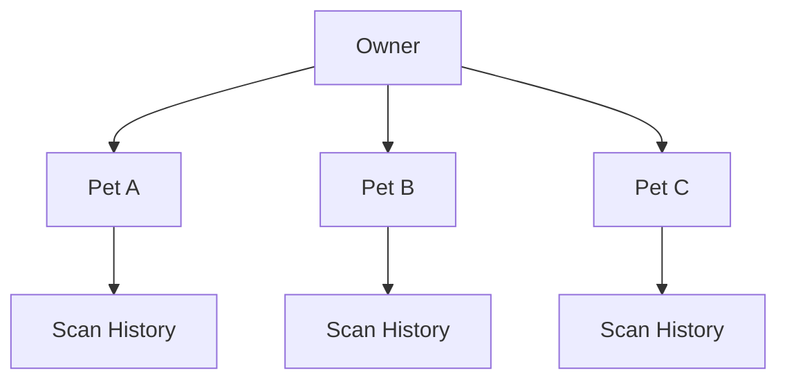

---

# 17. Scan History and Longitudinal Tracking

A single image provides less context than a sequence.

The timeline system can track:

```text
JAN 05
Baseline
   |
JAN 12
Similar
   |
JAN 19
Visible difference
   |
JAN 26
Difference persists
   |
FEB 02
Professional review suggested
```

The database should preserve:

* image,
* timestamp,
* scan region,
* quality score,
* confidence,
* AI result,
* user notes.

---

## Comparison architecture

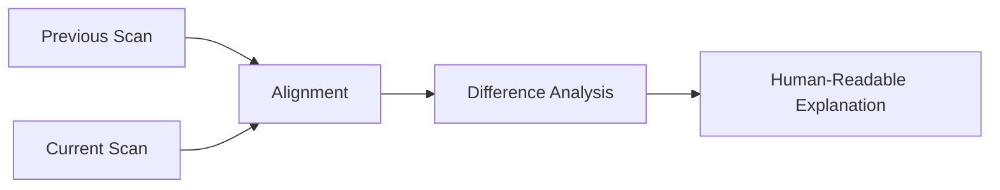

Example:

> "The selected region appears visually different from the saved baseline. Changes in lighting, distance, and camera angle can affect this comparison."

---

# 18. Data Model

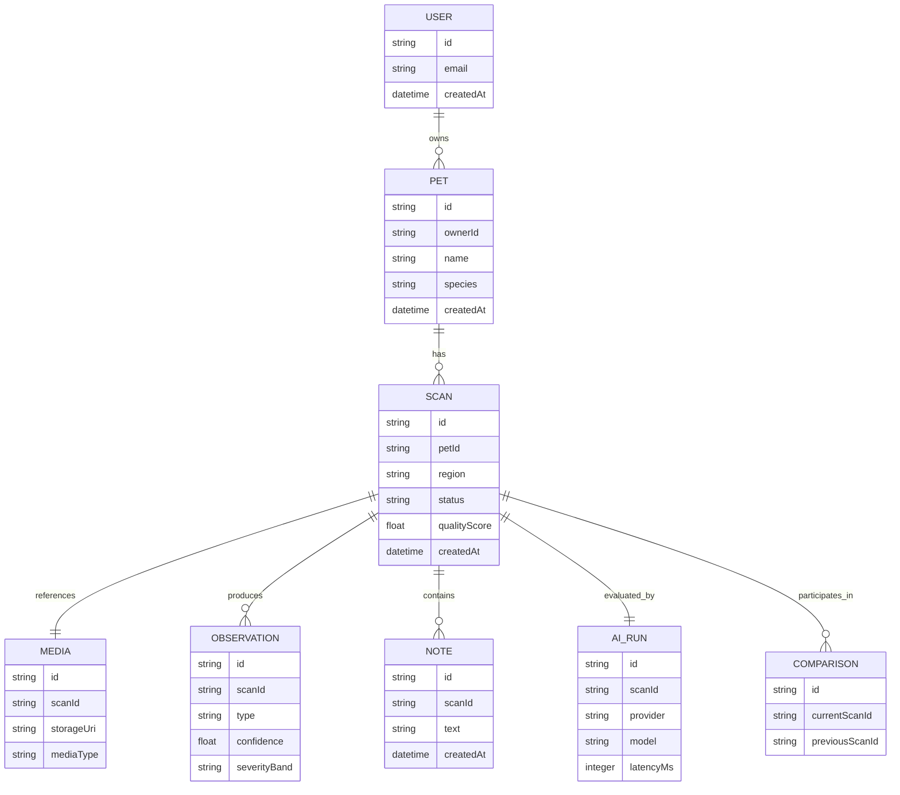

---

# 19. API Architecture

The backend should isolate the mobile application from AI providers.

```text
Mobile Application
       |
       | HTTPS
       v
   API Gateway
       |
  +----+---------+----------+
  |              |          |
  v              v          v
 Auth          Scan       History
 Service      Service      Service
                |
                v
          AI Orchestrator
                |
          +-----+-----+
          |           |
          v           v
       Provider     Queue
```

---

## Example endpoints

```text
POST   /v1/pets
GET    /v1/pets
GET    /v1/pets/:petId

POST   /v1/scans
GET    /v1/scans/:scanId
GET    /v1/pets/:petId/scans

POST   /v1/scans/:scanId/analyze
POST   /v1/scans/:scanId/compare
POST   /v1/scans/:scanId/share

DELETE /v1/scans/:scanId
DELETE /v1/media/:mediaId
```

---

# 20. AI Provider Abstraction

The application should not be tightly coupled to a single AI vendor.

Recommended interface:

```ts
export interface PetVisionProvider {
  analyze(
    input: VisionAnalysisInput
  ): Promise<VisionAnalysisResult>;
}

export interface VisionAnalysisInput {
  imageUri: string;
  region: string;
  petSpecies?: string;
  locale?: string;
}

export interface VisionAnalysisResult {
  observations: Observation[];
  confidence: number;
  limitations: string[];
  processingMs: number;
  providerMetadata?: Record<string, unknown>;
}
```

---

## Provider routing

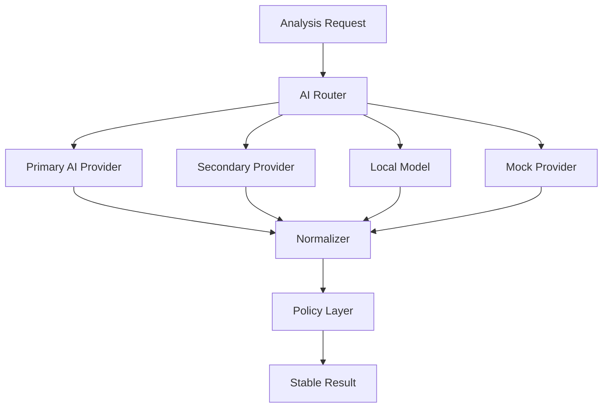

This allows the product to replace providers later without redesigning the UI.

---

# 21. Offline and Fallback Strategy

Mobile applications cannot assume constant connectivity.

The system should support:

```text
CAPTURE
  |
  v
LOCAL QUALITY CHECK
  |
  v
NETWORK AVAILABLE?
  /          \
YES           NO
|             |
v             v
UPLOAD      LOCAL QUEUE
|             |
v             |
AI ANALYSIS   |
|             |
+------+------+
       |
       v
   RESULT STATE
```

---

## Recommended states

```text
IDLE
CAPTURING
QUALITY_REVIEW
READY
QUEUED
ANALYZING
COMPLETE
LOW_CONFIDENCE
RETRYABLE_ERROR
OFFLINE
BLOCKED_BY_POLICY
```

The UI must distinguish:

> "The network is unavailable"

from:

> "The AI is uncertain."

---

# 22. Privacy and Data Protection

Pet images can reveal information about the user's home, location, household, or people who appear in the background.

Privacy therefore needs to be part of the architecture.

---

## Data minimization

Only collect information required by the application.

## Metadata minimization

Strip unnecessary EXIF metadata before cloud upload whenever possible.

## Secure storage

Use access-controlled private media storage.

## User controls

Users should be able to:

* delete scans,
* delete images,
* delete pet profiles,
* clear history,
* manage analytics preferences,
* control cloud processing where supported.

---

## Privacy flow

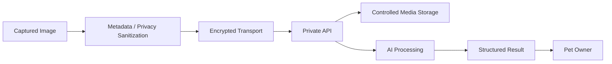

---

# 23. Security Architecture

## Threats

Potential security threats include:

* leaked API keys,
* unauthorized scan access,
* insecure image URLs,
* session token theft,
* malicious media uploads,
* oversized files,
* API abuse,
* prompt injection through user content,
* compromised third-party dependencies.

---

## Security architecture

```text
                MOBILE
                  |
                  v
             API GATEWAY
                  |
       +----------+-----------+
       |          |           |
       v          v           v
  Authentication Authorization Rate Limit
                  |
                  v
             Validation
                  |
                  v
            Domain Services
                  |
        +---------+---------+
        |                   |
        v                   v
      Media                AI
     Storage             Services
```

---

## Secret-management rule

Never put private production API keys directly inside a mobile application bundle.

Use a backend proxy or secure provider architecture.

---

# 24. Performance Engineering

The application must optimize both actual and perceived latency.

## User-perceived sequence

```text
0 ms
 |
 +-- Camera preview
 |
 +-- Capture feedback
 |
 +-- Local quality check
 |
 +-- "Preparing scan"
 |
 +-- Upload
 |
 +-- "Analyzing selected region"
 |
 +-- Result rendering
```

---

## Optimization areas

### Images

* resize unnecessarily large images,
* avoid repeated conversion,
* compress appropriately,
* upload the smallest useful representation.

### Network

* request cancellation,
* retry with backoff,
* request timeout,
* queued uploads.

### Rendering

* virtualized scan history,
* avoid repeated camera rerenders,
* lazy-load heavy screens.

### AI

* local quality screening,
* cache immutable results,
* avoid duplicate AI requests,
* route to appropriate models.

---

# 25. Accessibility and Inclusive UX

Accessibility should be part of the feature architecture.

## Support

* screen readers,
* dynamic text sizing,
* high contrast,
* large touch targets,
* reduced motion,
* voice feedback,
* localization.

---

## Accessibility example

Visual:

> Camera too far away

Accessible equivalent:

> "Move the camera closer. Your pet appears too small in the frame."

---

## Localization

Use translation keys:

```json
{
  "scan.capture.title": "Capture your pet",
  "scan.capture.guidance": "Keep the selected area centered",
  "scan.capture.retake": "Retake photo",
  "scan.result.lowConfidence": "We need a clearer image",
  "scan.result.professionalCare": "Consider veterinary evaluation"
}
```

Avoid scattering user-facing strings across business logic.

---

# 26. Observability and Diagnostics

AI products require observability at both the software and model layers.

## Application events

```text
scan_started
scan_capture_completed
scan_quality_failed
scan_quality_passed
scan_analysis_started
scan_analysis_completed
scan_analysis_failed
scan_result_saved
scan_shared
scan_deleted
```

---

## AI operational telemetry

Potential metadata:

* provider,
* model,
* latency,
* retry count,
* failure reason,
* quality score,
* confidence band.

Avoid storing raw pet imagery in ordinary logs.

---

## Request IDs

Example:

```text
scan_01J...
request_87AD...
ai_run_349...
```

This allows the complete pipeline to be traced.

---

# 27. Testing Strategy

The application should use a testing pyramid.

```text
                  /\
                 /  \
                / E2E\
               /------\
              /  INTEG \
             /----------\
            /    UNIT     \
           /---------------\
```

---

## Unit tests

Test:

* quality scoring,
* confidence mapping,
* validation,
* state transitions,
* serialization,
* error mapping.

---

## Integration tests

Test:

* API authentication,
* scan creation,
* upload,
* provider adapters,
* result persistence.

---

## UI tests

Test:

* navigation,
* permissions,
* camera states,
* loading,
* errors,
* results,
* accessibility.

---

## AI contract tests

Mock AI providers and confirm that:

```text
Provider Response
       |
       v
Normalizer
       |
       v
Domain Schema
       |
       v
UI
```

remains deterministic.

---

# 28. CI/CD

A recommended pipeline:

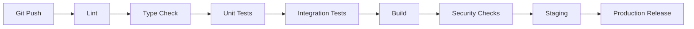

---

## Pull-request gates

* formatting,
* linting,
* type checking,
* unit tests,
* integration tests,
* dependency checks,
* build validation.

---

# 29. Environment Configuration

Use environment variables for infrastructure configuration.

Example:

```bash
APP_ENV=development

API_BASE_URL=http://localhost:3000

AI_PROVIDER=mock
AI_MODEL=development-model

MEDIA_MAX_SIZE_MB=10

ENABLE_ANALYTICS=false
ENABLE_REMOTE_AI=false
```

---

## Never commit

```text
API keys
Private tokens
Production secrets
Signing credentials
Service-account credentials
```

Use:

```text
.env.example
```

as the documented configuration template.

---

# 30. Deployment Architecture

A scalable deployment may look like:

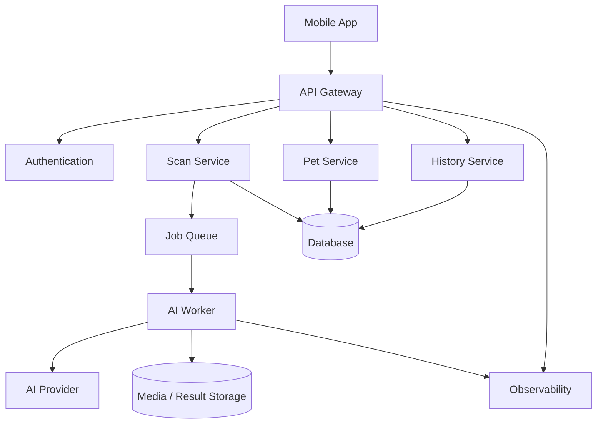

---

## Scaling principles

Keep mobile clients stateless.

Backend AI jobs should be:

* queued,
* retryable,
* idempotent,
* observable.

---

# 31. Recommended Project Structure

Because the visible public repository contains the application inside a ZIP, the following is a recommended target architecture rather than a claim about the exact current source layout.

```text
pet-health-scanner/
│
├── app/
│   ├── screens/
│   │   ├── Home/
│   │   ├── Scan/
│   │   ├── Results/
│   │   ├── History/
│   │   ├── Pets/
│   │   └── Settings/
│   │
│   ├── components/
│   ├── navigation/
│   └── theme/
│
├── domain/
│   ├── pet/
│   ├── scan/
│   ├── observation/
│   └── safety/
│
├── services/
│   ├── api/
│   ├── ai/
│   ├── media/
│   ├── storage/
│   └── analytics/
│
├── state/
├── utils/
├── tests/
├── assets/
├── config/
└── README.md
```

---

# 32. Development Workflow

```text
1. Pull latest source
        ↓
2. Install dependencies
        ↓
3. Configure environment
        ↓
4. Start backend / mock services
        ↓
5. Run mobile app
        ↓
6. Test scanner with mock AI
        ↓
7. Verify result states
        ↓
8. Run automated tests
        ↓
9. Test remote AI integration
        ↓
10. Commit / Pull Request
```

---

## Mock-first development

The application should not require a paid AI provider for ordinary UI development.

Example:

```ts
const provider =
  environment === "development"
    ? new MockPetVisionProvider()
    : new RemotePetVisionProvider();
```

This makes local development faster and safer.

---

# 33. Example API Contracts

## Create Pet

```http
POST /v1/pets
Authorization: Bearer <token>
Content-Type: application/json
```

```json
{
  "name": "Milo",
  "species": "dog",
  "breed": "optional"
}
```

Response:

```json
{
  "id": "pet_123",
  "name": "Milo",
  "species": "dog",
  "createdAt": "2026-09-16T12:00:00Z"
}
```

---

## Create Scan

```http
POST /v1/scans
Authorization: Bearer <token>
Content-Type: application/json
```

```json
{
  "petId": "pet_123",
  "region": "eye",
  "mediaType": "image"
}
```

Response:

```json
{
  "id": "scan_123",
  "status": "READY_FOR_UPLOAD"
}
```

---

## Start Analysis

```http
POST /v1/scans/scan_123/analyze
Authorization: Bearer <token>
```

Response:

```json
{
  "scanId": "scan_123",
  "status": "ANALYZING"
}
```

---

## Fetch Result

```http
GET /v1/scans/scan_123
Authorization: Bearer <token>
```

---

# 34. Example AI Result Schema

A stable domain-level schema isolates the application from specific providers.

```json
{
  "scanId": "scan_123",
  "status": "COMPLETE",

  "quality": {
    "score": 0.91,
    "focus": 0.94,
    "lighting": 0.87,
    "framing": 0.92
  },

  "observations": [
    {
      "type": "localized_visual_difference",
      "confidence": 0.78,
      "severityBand": "attention",

      "evidence": [
        "visible color variation"
      ]
    }
  ],

  "limitations": [
    "single image",
    "lighting can affect apparent color"
  ],

  "guidance": {
    "summary": "Compare with a clear image from a similar angle.",
    "professionalCare": true
  },

  "metadata": {
    "provider": "example",
    "model": "example-model",
    "processingMs": 1820
  }
}
```

---

# 35. State Machine

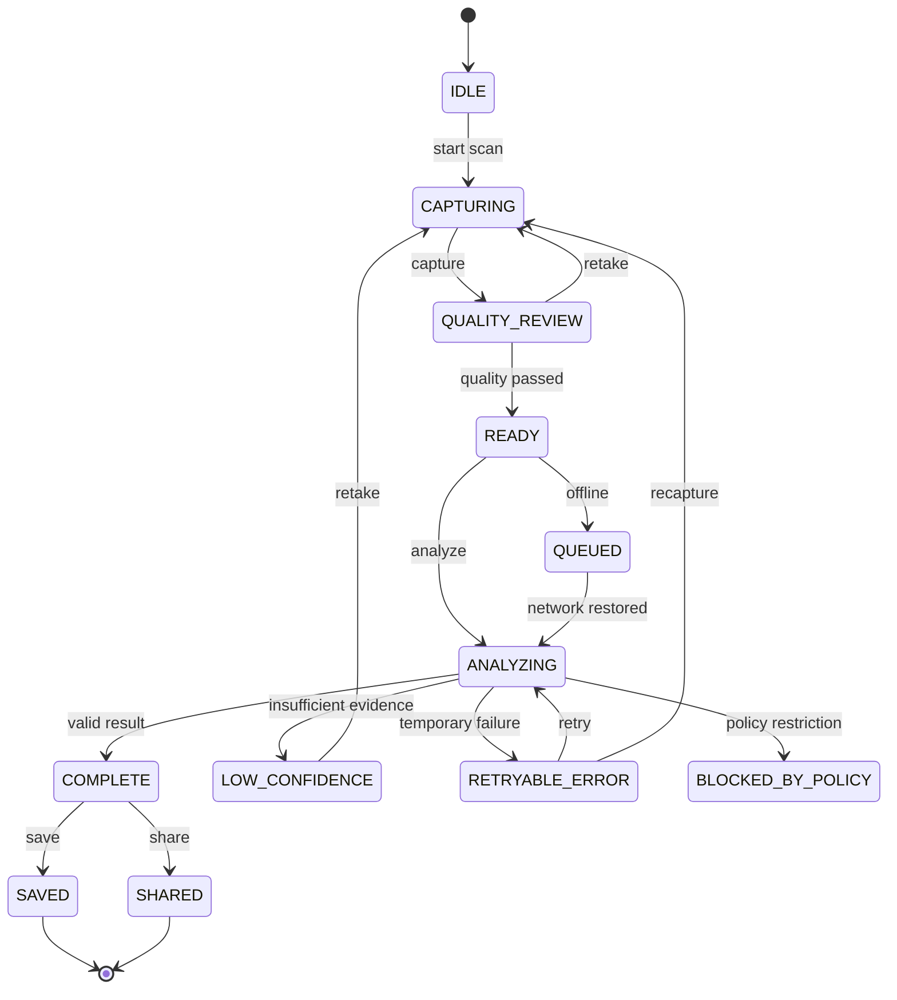

Explicit state management prevents ambiguous situations such as an app showing:

> "Analyzing..."

after the request has actually failed.

---

# 36. End-to-End Sequence

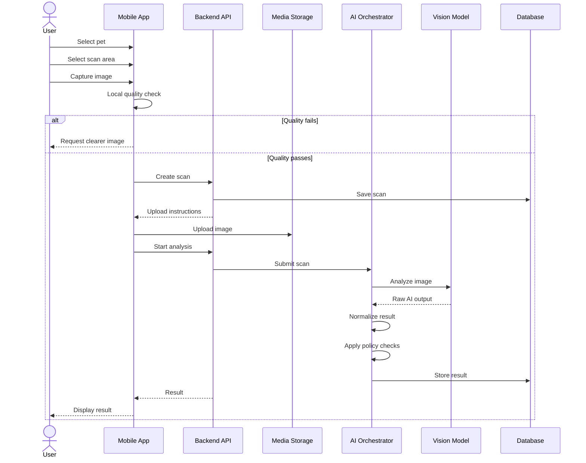

---

# 37. Failure Modes

Every external service can fail.

| Failure              | User Experience        | Recovery           |
| -------------------- | ---------------------- | ------------------ |
| Camera denied        | Explain permissions    | Open settings      |
| Image blurry         | Capture guidance       | Retake             |
| Image dark           | Lighting guidance      | Retake             |
| Pet not detected     | Request clearer image  | Retake             |
| Region missing       | Request better framing | Retake             |
| Network unavailable  | Save locally           | Retry              |
| AI timeout           | Retry state            | Retry request      |
| Provider unavailable | Fallback               | Alternate provider |
| Confidence low       | Explain uncertainty    | Retake             |
| Storage error        | Preserve local state   | Retry upload       |

---

## Example error contract

```json
{
  "code": "IMAGE_QUALITY_TOO_LOW",
  "message": "The image is too blurry to analyze reliably.",
  "retryable": true,
  "userAction": "CAPTURE_AGAIN"
}
```

Machine-readable error codes prevent the client from parsing human-readable messages.

---

# 38. Product Analytics

Analytics should measure product behavior without collecting unnecessary personal information.

## Suggested events

```text
onboarding_completed
pet_created
scan_started
scan_captured
scan_quality_failed
scan_quality_passed
analysis_started
analysis_completed
analysis_retried
result_viewed
result_saved
result_shared
comparison_viewed
reminder_created
subscription_started
```

---

## Funnel

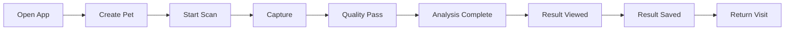

Potential metrics:

* scan completion rate,
* capture retry rate,
* quality rejection rate,
* AI latency,
* result save rate,
* repeat usage,
* average scans per pet.

---

# 39. Monetization Architecture

AI infrastructure and media storage can create recurring costs.

A subscription architecture can separate the free and advanced layers.

---

## Free Tier

Possible features:

* limited scans,
* one pet profile,
* standard history,
* standard observations.

## Premium Tier

Possible features:

* expanded scan limits,
* advanced comparison,
* unlimited history,
* multiple pets,
* reports,
* advanced AI processing.

## Household Tier

Possible features:

* multiple owners,
* multiple pets,
* shared scan history,
* account permissions.

---

## Billing architecture

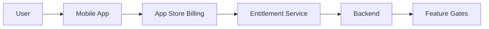

Premium AI features should be authorized on the backend rather than enforced exclusively by UI logic.

---

# 40. Roadmap

## Phase 1 — Core Scanner

* pet profiles,
* guided capture,
* image quality,
* AI result,
* local history.

## Phase 2 — Longitudinal Intelligence

* baselines,
* comparison,
* reminders,
* trend summaries.

## Phase 3 — Personalization

* pet-specific context,
* adaptive scan reminders,
* personalized capture instructions.

## Phase 4 — Sharing

* downloadable reports,
* veterinarian-oriented summaries,
* shared household access.

## Phase 5 — Advanced AI

* video analysis,
* multimodal history,
* temporal comparisons,
* richer region-specific workflows.

---

# 41. Future AI Capabilities

## 41.1 Multimodal analysis

Combine:

```text
Photo
+
Video
+
User Notes
+
Previous Scans
=
Contextual Observation
```

---

## 41.2 Temporal intelligence

Instead of analyzing only:

> "What does this image look like?"

the system can ask:

> "How is this image different from the saved baseline?"

This is a major opportunity for future AI development.

---

## 41.3 Personalized capture coaching

Example:

```text
Repeated dark photos
       ↓
Detect capture pattern
       ↓
Provide earlier lighting guidance
       ↓
Fewer retakes
       ↓
Better AI evidence
```

---

## 41.4 Conversational AI

The application can eventually offer a structured assistant for:

* explaining the observation,
* requesting missing evidence,
* guiding a retake,
* organizing user notes,
* generating professional summaries.

The assistant should remain grounded in the actual scan and should not invent medical history.

---

# 42. Potential Integrations

The architecture supports multiple categories of integrations.

## Veterinary workflows

* structured report export,
* appointment handoff,
* observation summaries.

## Cloud services

* encrypted backup,
* cross-device synchronization.

## Notification systems

* scan reminders,
* follow-up reminders,
* care schedules.

## AI infrastructure

* vision APIs,
* multimodal models,
* object detection,
* image embeddings.

## Monetization

* subscriptions,
* entitlement services,
* household plans.

---

## Integration architecture

```text
Product Domain
      |
      v
Adapter Interface
      |
  +---+---+---+
  |   |   |   |
  A   B   C   D
```

Every third-party service should be replaceable.

---

# 43. Demo and Hackathon Presentation Flow

A strong product demo can be organized as:

## Scene 1 — Problem

> Pet owners notice visual changes but often lack a structured way to capture and track those observations.

## Scene 2 — Capture

Show the guided camera workflow.

## Scene 3 — AI

Show:

```text
Capture
  ↓
Quality
  ↓
Region
  ↓
AI
  ↓
Confidence
```

## Scene 4 — Result

Show a structured observation.

## Scene 5 — History

Show the same pet across multiple dates.

## Scene 6 — Safety

Demonstrate how uncertainty and professional escalation are surfaced.

---

# 44. Contribution Guide

## Branch Naming

```text
feature/scan-history
feature/pet-profile
feature/ai-provider
feature/comparison
fix/camera-permissions
fix/result-rendering
chore/dependency-update
```

---

## Commit style

```text
feat: add scan history comparison
fix: handle camera permission denial
docs: expand AI architecture
test: add confidence mapper coverage
```

---

## Pull requests should include

* what changed,
* why it changed,
* test coverage,
* UI screenshots when relevant,
* API contract changes,
* privacy impact if applicable.

---

# 45. Coding Standards

## General

* keep functions focused,
* validate inputs,
* centralize constants,
* use typed contracts,
* handle failures explicitly,
* avoid provider logic in UI.

---

## Avoid

```ts
try {
  await something();
} catch (error) {
  // ignore
}
```

---

## Prefer

```ts
try {
  await something();
} catch (error) {
  logger.error("scan.failed", {
    error: normalizeError(error),
  });

  throw new ScanProcessingError(
    "SCAN_PROCESSING_FAILED"
  );
}
```

---

## AI-specific rule

Never silently turn:

```text
unknown
```

into:

```text
healthy
```

Unknown must remain unknown.

---

# 46. Pull Request Checklist

## Product

* [ ] Main flow works
* [ ] Loading states exist
* [ ] Empty states exist
* [ ] Error states exist
* [ ] Retry flow exists

## AI

* [ ] Model response is validated
* [ ] Confidence is handled
* [ ] Uncertainty is preserved
* [ ] Provider-specific logic remains isolated

## Privacy

* [ ] Secrets are not committed
* [ ] Raw images are not logged
* [ ] Upload behavior reviewed
* [ ] Delete behavior tested

## Quality

* [ ] Unit tests added
* [ ] Integration tests updated
* [ ] Build succeeds
* [ ] Accessibility reviewed

---

# 47. Troubleshooting

## Camera Does Not Open

Check:

1. camera permission,
2. platform configuration,
3. native camera dependency,
4. physical device behavior,
5. simulator limitations.

---

## Scan Gets Stuck

Check:

1. request ID,
2. backend status,
3. queue,
4. provider response,
5. network state,
6. retry logic.

---

## AI Results Look Poor

Check:

1. image quality,
2. camera distance,
3. lighting,
4. selected region,
5. model confidence,
6. whether enough visual evidence exists.

---

## Scan Is Slow

Break latency into:

```text
Capture
+
Upload
+
Queue
+
AI inference
+
Normalization
+
Database
+
Rendering
```

Measure every stage independently.

---

# 48. FAQ

## Is AI Pet Scanner a veterinarian?

No.

It is an AI-assisted pet wellness screening and observation application concept.

It should not replace veterinary care.

---

## Can AI Pet Scanner diagnose a condition?

The product should avoid representing visual AI output as definitive diagnosis.

---

## Why does image quality matter?

AI systems can only reason from the evidence provided.

Blur, bad lighting, occlusion, and poor framing reduce the quality of that evidence.

---

## Can scans be compared?

Yes.

The architecture supports longitudinal comparison between historical and current scans.

---

## Can multiple pets be supported?

Yes.

The data model is designed around:

```text
Owner
  ↓
Pets
  ↓
Scans
```

---

## Can the AI provider be changed?

Yes.

The provider adapter architecture is designed specifically to reduce vendor lock-in.

---

## Can the app work offline?

Local capture, quality checks, and queued operations can work without immediate cloud connectivity depending on the implementation.

---

# 49. Glossary

### AI Provider

A system that performs visual or multimodal AI inference.

### Observation

A structured description of an AI-detected visual signal.

### Confidence

A representation of AI uncertainty.

### Quality Score

An estimate of whether evidence is sufficiently usable for analysis.

### Region of Interest

The portion of an image relevant to the scan.

### Longitudinal Tracking

Comparing observations across time.

### Policy Layer

The deterministic layer controlling how AI output is presented.

### Provider Adapter

An interface separating external AI services from application logic.

### Scan

A timestamped analysis containing evidence, metadata, and results.

---

# 50. License

This project is distributed under the **MIT License**.

See:

```text
LICENSE
```

The MIT license permits reuse, modification, distribution, and private or commercial use subject to the license terms.

---

# 51. Acknowledgements

AI Pet Scanner sits at the intersection of:

* mobile development,
* computer vision,
* multimodal AI,
* cloud infrastructure,
* product design,
* data visualization,
* pet wellness.

This documentation intentionally distinguishes:

### Verified repository information

Information directly visible from the public repository.

### Recommended architecture

Implementation patterns that can be applied to the project.

### Example contracts

Illustrative schemas for building a production implementation.

### Future capabilities

Potential expansion areas rather than claims that they are already implemented.

---

# Appendix A — Full System Architecture

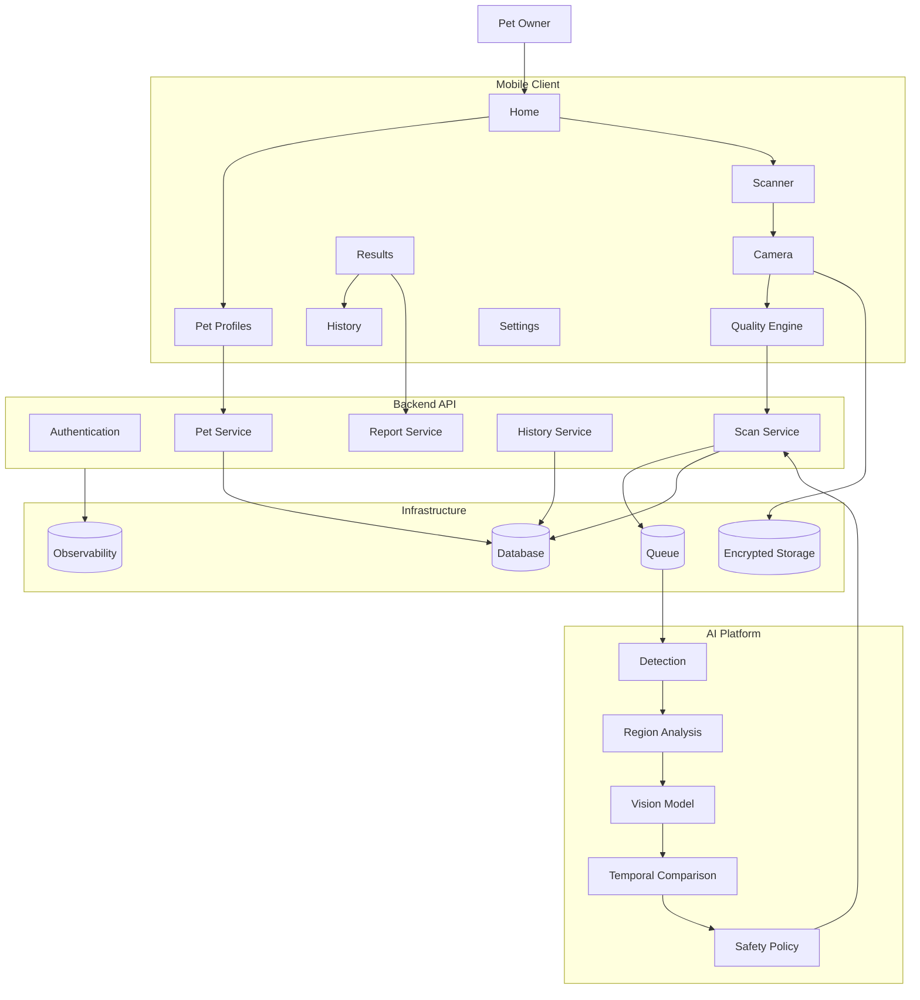

---

# Appendix B — AI Safety Decision Tree

```text
                 IMAGE RECEIVED
                       |
                       v
              Is media readable?
                 /           \
               NO             YES
               |               |
               v               v
          Request retake    Pet detected?
                              /     \
                            NO       YES
                            |         |
                            v         v
                       Request      Region visible?
                       retake         /      \
                                    NO        YES
                                    |          |
                                    v          v
                                Request      Analyze
                                retake         |
                                               v
                                      Confidence sufficient?
                                       /              \
                                     NO                YES
                                     |                   |
                                     v                   v
                              Low confidence          Result
                                     |                   |
                                     +---------+---------+
                                               |
                                               v
                                      Next-step guidance
                                               |
                                               v
                                      Professional-care
                                        consideration
```

---

# Appendix C — Data Lifecycle

```mermaid
flowchart LR

    CAPTURE[Capture]
       --> VALIDATE[Validate]

    VALIDATE
       --> SANITIZE[Sanitize]

    SANITIZE
       --> ENCRYPT[Encrypt]

    ENCRYPT
       --> UPLOAD[Upload]

    UPLOAD
       --> ANALYZE[Analyze]

    ANALYZE
       --> NORMALIZE[Normalize]

    NORMALIZE
       --> STORE[Store Result]

    STORE
       --> DISPLAY[Display]

    DISPLAY
       --> COMPARE[Future Comparison]

    COMPARE
       --> DELETE[Delete / Export]
```

---

# Appendix D — Suggested Engineering Backlog

## Scanner

* [ ] Guided camera
* [ ] Image-quality scoring
* [ ] Lighting detection
* [ ] Focus detection
* [ ] Pet detection
* [ ] Region detection
* [ ] Retake coaching

## AI

* [ ] AI provider interface
* [ ] Mock provider
* [ ] Provider fallback
* [ ] Confidence mapper
* [ ] Result normalizer
* [ ] Safety rules
* [ ] Prompt/version management

## History

* [ ] Pet persistence
* [ ] Scan history
* [ ] Baseline scan
* [ ] Comparison
* [ ] Notes
* [ ] Timeline visualization

## Backend

* [ ] Authentication
* [ ] Scan API
* [ ] Media storage
* [ ] AI job queue
* [ ] Database
* [ ] Observability
* [ ] Rate limits

## Monetization

* [ ] Free tier
* [ ] Premium tier
* [ ] Multi-pet plan
* [ ] Entitlement service
* [ ] Usage tracking

---

# Appendix E — Example TypeScript Domain Types

```ts
export type PetSpecies =
  | "dog"
  | "cat"
  | "other";

export type ScanRegion =
  | "general"
  | "eye"
  | "ear"
  | "skin"
  | "coat"
  | "mouth"
  | "teeth"
  | "paw";

export type ScanStatus =
  | "READY"
  | "QUEUED"
  | "ANALYZING"
  | "COMPLETE"
  | "LOW_CONFIDENCE"
  | "FAILED"
  | "BLOCKED";

export type SeverityBand =
  | "informational"
  | "attention"
  | "professional_review";

export interface Pet {
  id: string;
  ownerId: string;
  name: string;
  species: PetSpecies;
  createdAt: string;
}

export interface Scan {
  id: string;
  petId: string;
  region: ScanRegion;
  status: ScanStatus;
  qualityScore?: number;
  createdAt: string;
}

export interface Observation {
  type: string;
  confidence: number;
  severityBand: SeverityBand;
  evidence: string[];
  limitations: string[];
}
```

---

# Appendix F — AI Provider Interface

```ts
export interface PetVisionProvider {
  name: string;

  analyze(
    input: VisionAnalysisInput
  ): Promise<VisionAnalysisResult>;

  healthCheck(): Promise<boolean>;
}

export interface VisionAnalysisInput {
  imageUri: string;
  region: ScanRegion;
  petSpecies?: PetSpecies;
  promptContext?: string;
}

export interface VisionAnalysisResult {
  observations: Observation[];
  confidence: number;
  limitations: string[];
  processingMs: number;
}
```

---

# Appendix G — Example Result Rendering Contract

```json
{
  "headline": "Needs closer attention",
  "summary": "A visible difference was detected in the selected region.",

  "confidence": {
    "value": 0.78,
    "band": "moderate"
  },

  "why": [
    "The selected region was clearly visible",
    "Image quality passed the minimum threshold"
  ],

  "limitations": [
    "This was a single image",
    "Lighting can affect apparent color"
  ],

  "nextSteps": [
    "Retake a clear image from a similar angle",
    "Compare with a previous saved scan"
  ],

  "professionalCare": true
}
```

The mobile application can then localize and render the result consistently.

---

# Appendix H — API Error Taxonomy

```text
AUTH_REQUIRED
AUTH_EXPIRED
FORBIDDEN

INVALID_INPUT
INVALID_MEDIA
MEDIA_TOO_LARGE
MEDIA_UNSUPPORTED

IMAGE_QUALITY_TOO_LOW
PET_NOT_DETECTED
REGION_NOT_VISIBLE

AI_PROVIDER_TIMEOUT
AI_PROVIDER_UNAVAILABLE
AI_PROVIDER_RATE_LIMITED
AI_RESPONSE_INVALID

SCAN_NOT_FOUND
PET_NOT_FOUND
MEDIA_NOT_FOUND

STORAGE_ERROR
DATABASE_ERROR

UNKNOWN_ERROR
```

---

# Appendix I — Definition of Done

A scan feature is complete when:

```text
[ ] Capture works
[ ] Permissions work
[ ] Retake works
[ ] Image validation works
[ ] Offline state works
[ ] Network failure works
[ ] AI failure works
[ ] Confidence is displayed
[ ] Uncertainty is displayed
[ ] Result can be saved
[ ] Result can be deleted
[ ] History works
[ ] Comparison works
[ ] Accessibility labels exist
[ ] Analytics are instrumented
[ ] Tests cover success
[ ] Tests cover failure
[ ] Documentation is updated
```

---

# Final Product Principle

AI Pet Scanner should make it easier to:

```text
NOTICE
   ↓
CAPTURE
   ↓
STRUCTURE
   ↓
COMPARE
   ↓
COMMUNICATE
```

The fundamental boundary remains:

```text
AI Observation
       ≠
Medical Diagnosis
```

The strongest implementation is therefore one that:

* requests better evidence when evidence is weak,
* communicates uncertainty,
* preserves scan history,
* enables visual comparison,
* protects private pet media,
* provides understandable next steps,
* and helps owners communicate useful information to veterinary professionals.

---

## Repository

**GitHub:**
https://github.com/lucylow/ai-pet-scanner

**License:** MIT

**Primary bundled artifact:** `pet-health-scanner.zip`
